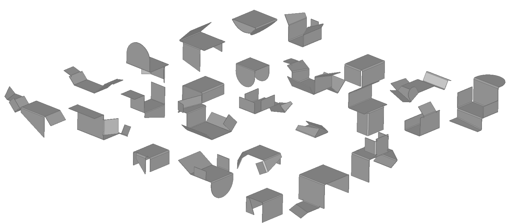

# BenDFM: A Synthetic Dataset for Manufacturability Assessment in Sheet Metal Bending



<p align="center">
  <span style="font-size:1.5em;"><u><strong><a href="https://zenodo.org/records/18622958">📊 Download BenDFM Dataset on Zenodo</a></strong></u></span>
</p>

This repository hosts **BenDFM**, a large-scale synthetic dataset of sheet metal parts designed for data-driven Design for Manufacturing (DFM) research. 

The dataset is introduced in the paper: *BenDFM: A taxonomy and synthetic dataset for manufacturability assessment in sheet metal bending*, **accepted at the Journal of Intelligent Manufacturing**. This repository contains the analysis code and dataset structure; the full dataset is available on Zenodo.

- Geometrically diverse 3D sheet metal bending parts and their unfolded representations.
- Rich part-level metadata.
- Comprehensive manufacturability labels structured according to a novel taxonomy, spanning both geometric and configurational feasibility and complexity.

BenDFM enables a wide range of tasks, including binary feasibility classification, regression of manufacturing complexity, and analysis of process constraints.

The dataset is split into two subsets: **BenDFM** and **BenDFM-U**, each balanced to support specific manufacturability tasks.

---

## Dataset Overview

- **Total Parts**: 20,000 unique 3D bent part geometries in STEP format.
- **Subset 1 — BenDFM**: 14,000 parts with 2–8 bends, tooling collisions balanced at 50%, all parts guaranteed free of unfolding overlaps.
- **Subset 2 — BenDFM-U**: 6,000 parts with 7–10 bends, balanced 50/50 for unfolding overlaps.

---

## Dataset generation parameters

- **Base Sheet Dimensions**: 150–300 mm (length & width, uniform sampling)
- **Sheet Thickness**: 2–6 mm
- **Bend Angles**: {45°, 60°, 90°, 120°, 135°}, biased toward 90°
- **Flange Heights**: 75 mm to maximum sheet dimension
- **Bend Radii**: 1.0–1.5 × sheet thickness
- **Realism Features**: Automatic bend reliefs, flange geometry variants, symmetry bias

---

## File Structure

Each part (identified by `identifier` 0–19999) contains:

- `identifier.stp`: 3D CAD model of the bent part.
- `identifier_unfolded.stp`: 2D unfolded CAD model.
- `identifier_sequence.json`: Base plate parameters and ordered bend sequence.
- `identifier_labels.json`: Detailed manufacturability and descriptive labels.

You can find sample files in the [`example_files`](example_files/) folder, which contains the first 5 designs from the training set, with a detailed description of the file types and their contents given in [`file_types`](docs/file_types.md).
**The full dataset will be released upon publication.**

## Dataset characteristics

For an overview of the most important dataset characteristics, we refer to [`dataset_characteristics`](docs/dataset_characteristics.md)
## Publications

Please cite the following publication if you use BenDFM:

```bibtex
@article{ballegeer2026bendfm,
      title={BenDFM: A taxonomy and synthetic CAD dataset for manufacturability assessment in sheet metal bending}, 
      author={Matteo Ballegeer and Dries F. Benoit},
      year={2026},
      note={Accepted at Journal of Intelligent Manufacturing},
      eprint={2603.13102},
      archivePrefix={arXiv},
      primaryClass={cs.CV},
      url={https://arxiv.org/abs/2603.13102},
      doi={10.48550/arXiv.2603.13102}
}
```

**Dataset**: [https://zenodo.org/records/18622958](https://zenodo.org/records/18622958)

---

## Repository Structure

```
BenDFM/
├── data/
│   ├── bendfm/                  # BenDFM subset (14 000 parts, 2–8 bends)
│   │   ├── train/
│   │   │   ├── *.stp            # 3D bent parts
│   │   │   ├── *_unfolded.stp   # 2D unfolded parts
│   │   │   ├── *_labels.json    # Manufacturability labels
│   │   │   ├── *_sequence.json  # Bend sequence metadata
│   │   │   ├── pcs/             # Point clouds (.npy)  ← generated by brep_to_pc.py
│   │   │   └── graphs/          # UV-grid DGL graphs (.bin) ← generated by features.py
│   │   ├── val/                 # Same structure as train/
│   │   └── test/                # Same structure as train/
│   └── bendfm_u/                # BenDFM-U subset (6 000 parts, 7–10 bends)
│       ├── train/               # Same structure as above
│       ├── val/
│       └── test/
├── benchmark/
│   ├── input_transformation/
│   │   ├── brep_to_pc.py        # STEP → point cloud (.npy)
│   │   ├── features.py          # STEP → UV-grid DGL graph (.bin)
│   │   └── graph_dataset.py     # Graph dataset loader (used by UV-Net)
│   ├── models/
│   │   ├── uvnet/               # UV-Net model
│   │   └── openpoints/          # OpenPoints framework (PointNeXt) - optional
│   └── train/
│       ├── uvnet.py             # UV-Net training script (recommended)
│       └── pointnext.py         # PointNeXt training script (requires openpoints setup)
├── example_files/               # Sample parts (first 5 designs)
├── docs/                        # Documentation and figures
├── environment.yml              # Conda environment specification
├── install.sh                   # Setup script for PointNeXt (optional)
├── LICENSE
└── README.md
```

---

## Quick Start

1. **Create environment**: `conda env create -f environment.yml && conda activate bendfm`
2. **Download dataset**: Extract to `data/bendfm/` or `data/bendfm_u/`
3. **Train UV-Net**: `python benchmark/train/uvnet.py --data_dir data/bendfm --label_key y_tool_collision`

> All commands should be run from the repository root.

---

## Data Preparation

### Step 1: Download the dataset

Download BenDFM and/or BenDFM-U from **[Zenodo](https://zenodo.org/records/18622958)** and extract under the `data/` folder:

```
data/bendfm/{train,val,test}/   # BenDFM subset (14,000 parts, 2-8 bends)
data/bendfm_u/{train,val,test}/ # BenDFM-U subset (6,000 parts, 7-10 bends)
```

Each split directory contains:
- Raw STEP files (`.stp`, `_unfolded.stp`)
- JSON metadata (`_labels.json`, `_sequence.json`)
- Pre-generated input representations:
  - `graphs/`: UV-grid DGL graphs for UV-Net
  - `pcs/`: Point clouds for PointNeXt

**Full dataset**: Available on [Zenodo](https://zenodo.org/records/18622958)
**Sample files**: First 5 parts available in [`example_files`](example_files/)

### Step 2: Input representations (optional)

The downloaded dataset already includes pre-generated input representations:
- **`graphs/`**: UV-grid DGL graphs for UV-Net
- **`pcs/`**: Point clouds for PointNeXt

These can be used directly for training. However, if you want to regenerate them, use the scripts below:

**For UV-Net** — Regenerate UV-grid DGL graphs:

```bash
# BenDFM
python benchmark/input_transformation/features.py --input_dir data/bendfm/train --output_dir data/bendfm/train/graphs
python benchmark/input_transformation/features.py --input_dir data/bendfm/val   --output_dir data/bendfm/val/graphs
python benchmark/input_transformation/features.py --input_dir data/bendfm/test  --output_dir data/bendfm/test/graphs

# BenDFM-U
python benchmark/input_transformation/features.py --input_dir data/bendfm_u/train --output_dir data/bendfm_u/train/graphs
python benchmark/input_transformation/features.py --input_dir data/bendfm_u/val   --output_dir data/bendfm_u/val/graphs
python benchmark/input_transformation/features.py --input_dir data/bendfm_u/test  --output_dir data/bendfm_u/test/graphs
```

**For PointNeXt** — Regenerate point clouds:

```bash
# BenDFM
python benchmark/input_transformation/brep_to_pc.py --input_dir data/bendfm/train
python benchmark/input_transformation/brep_to_pc.py --input_dir data/bendfm/val
python benchmark/input_transformation/brep_to_pc.py --input_dir data/bendfm/test

# BenDFM-U
python benchmark/input_transformation/brep_to_pc.py --input_dir data/bendfm_u/train
python benchmark/input_transformation/brep_to_pc.py --input_dir data/bendfm_u/val
python benchmark/input_transformation/brep_to_pc.py --input_dir data/bendfm_u/test
```

---

## Installation

### Setup environment

Create the conda environment with all dependencies:

```bash
conda env create -f environment.yml
conda activate bendfm
```

### OpenPoints (for PointNeXt - Optional)

If you plan to use **PointNeXt**, initialize the OpenPoints submodule:

```bash
git submodule update --init --recursive
```

Then follow the [OpenPoints installation guide](https://github.com/guochengqian/openpoints#installation) for any additional setup.

---

## Benchmark

### UV-Net (Recommended) — Graph-based

**No additional setup required.** Train directly with:

```bash
# Regression task (manufacturability complexity)
python benchmark/train/uvnet.py --data_dir data/bendfm --label_key bbox_area_unfolded --regression

# Binary classification (tool collision feasibility)
python benchmark/train/uvnet.py --data_dir data/bendfm --label_key y_tool_collision

# Binary classification (unfolding collision feasibility)
python benchmark/train/uvnet.py --data_dir data/bendfm_u --label_key y_unfolding_collision
```

Run `python benchmark/train/uvnet.py --help` for options (batch size, learning rate, epochs, patience, seed, etc.).

Results are saved to `results/uvnet/{dataset}/{label_key}/`.

---

### PointNeXt (Optional) — Point Cloud-based

**Requires additional setup.** Point cloud representation; requires [OpenPoints](https://github.com/guochengqian/openpoints) framework. To use:

1. Initialize submodule: `git submodule update --init --recursive`
2. Follow [OpenPoints installation](https://github.com/guochengqian/openpoints#installation)

Once configured, train with:

```bash
# Regression task
python benchmark/train/pointnext.py --data_dir data/bendfm --label_key bbox_area_unfolded --regression

# Binary classification (tool collision)
python benchmark/train/pointnext.py --data_dir data/bendfm --label_key y_tool_collision

# Binary classification (unfolding collision)
python benchmark/train/pointnext.py --data_dir data/bendfm_u --label_key y_unfolding_collision
```

Run `python benchmark/train/pointnext.py --help` for full options.

Results are saved to `results/pointnext/{dataset}/{label_key}/`.

---


## Contact
For questions or collaboration, please contact the authors via email: [matteo.ballegeer@ugent.be](mailto:matteo.ballegeer@ugent.be)

See [`LICENSE`](LICENSE) for terms of use.
