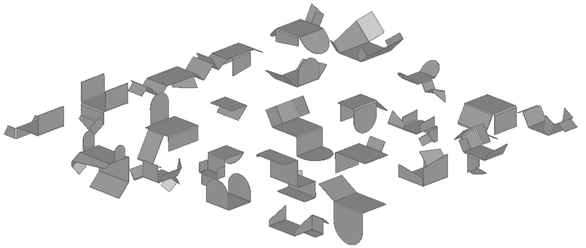

# BenDFM: A Synthetic Dataset for Manufacturability Assessment in Sheet Metal Bending


<p align="center">
  <span style="font-size:1.5em;"><u><strong>Full dataset release will follow publication.</strong></u></span>
</p>

This repository contains the **BenDFM** dataset, a large-scale, synthetic dataset of sheet metal parts designed for data-driven Design for Manufacturing (DFM) research. 
The dataset is introduced in the paper: *BenDFM: A data-driven framework and synthetic dataset for manufacturability assessment in sheet metal bending* and provides geometrically diverse sheet metal bending parts, their unfolded representations, rich metadata, and a comprehensive set of manufacturability labels. These labels are structured according to a novel taxonomy, spanning geometric and configurational feasibility and complexity, making the dataset suitable for a wide range of tasks from binary feasibility classification to complexity regressions in sheet metal bending DFM.

The dataset is provided as two subsets: **BenDFM** and **BenDFM-U**, each balanced towards a specific manufacturability task.

---

## Dataset Description

The full dataset comprises 20,000 unique 3D bent part geometries in STEP format.

### BenDFM Subset
This is the primary subset, designed around the **tooling collision** prediction task (configurational feasibility).
- **Size**: 14,000 parts.
- **Bend Counts**: 2 to 8 bends (2,000 parts for each bend count).
- **Tooling Collision Rate**: 50.0%
- **Constraint**: All parts in this subset are guaranteed to be free of unfolding overlaps.

### BenDFM-U Subset
This subset targets the **unfolding overlap** prediction task (geometric feasibility).
- **Size**: 6,000 parts.
- **Bend Counts**: 7 to 10 bends.
- **Balancing**: This subset is balanced with a 50/50 split between parts that have unfolding overlaps and those that do not, stratified by bend count.
- **Unfolding Overlap Rate**: 50.0%

---

## Dataset Characteristics & Generation

The dataset was generated to reflect common industrial practices and ensure a challenging benchmark for learning models.

**Key Generation Parameters:**
- **Base Sheet Dimensions**: Length and width uniformly sampled from 150 mm to 300 mm.
- **Sheet Thickness**: Uniformly sampled from 2.0 mm to 6.0 mm.
- **Bend Angles**: Drawn from $\{45^\circ, 60^\circ, 90^\circ, 120^\circ, 135^\circ\}$, with a bias toward $90^\circ$.
- **Flange Heights**: Sampled between 75 mm and the maximum base sheet dimension.
- **Bend Radii**: Sampled proportionally to sheet thickness (1.0-1.5x).
- **Realism Features**: Includes automatic insertion of bend reliefs, flange geometry variants, and a symmetry bias.

---

## File Structure

For each design, identified by its `identifier` (a number between 0 and 19999), the dataset provides 4 files:

- `identifier.stp`: The 3D CAD file of the bent part in STEP format.
- `identifier_unfolded.stp`: The CAD file of the 2D unfolded representation in STEP format.
- `identifier_sequence.json`: A JSON file containing the parameters of the base plate and the full, ordered bend sequence.
- `identifier_labels.json`: A JSON file containing a rich set labels, both descriptive and related to different facets of manufacturability

The `examples` folder contains the first 5 designs from the training set.

### Full Label Table (`identifier_labels.json`)

| Label Key                | Type    | Description                                                        |
|--------------------------|---------|--------------------------------------------------------------------|
| total_bends              | int     | Number of bends in the part                                        |
| y_tool_collision         | int/bool| 1 if any bend collides with punch/die, else 0                      |
| y_unfolding_collision    | int/bool| 1 if unfolded part self-intersects, else 0                         |
| num_punch_collisions     | int     | Number of punch collisions across all bends                        |
| num_die_collisions       | int     | Number of die collisions across all bends                          |
| sheet_flips              | int     | Number of times the sheet is flipped during manufacturing          |
| total_punch_rotations    | float   | Total punch rotation angle (degrees)                               |
| total_bend_distances     | float   | Total travel distance (mm) for all bends                           |
| part_volume_3d           | float   | Volume of the part (cm³)                                           |
| bbox_volume_3d           | float   | Volume of 3D bounding box (cm³)                                    |
| part_mass_kg             | float   | Mass of the part (kg)                                              |
| bbox_area_unfolded       | float   | Area of unfolded bounding box (cm²)                                |
| sheet_thickness          | float   | Thickness of the sheet (mm)                                        |
| num_rounded_flanges      | int     | Number of rounded flanges                                          |
| num_slanted_flanges      | int     | Number of slanted flanges                                          |
| min_bend_height          | float   | Minimum bend height (mm)                                           |
| max_bend_height          | float   | Maximum bend height (mm)                                           |
| min_bend_radius          | float   | Minimum bend radius (mm)                                           |
| max_bend_radius          | float   | Maximum bend radius (mm)                                           |
| min_bend_angle           | float   | Minimum bend angle (degrees)                                       |
| max_bend_angle           | float   | Maximum bend angle (degrees)                                       |
| num_bend_reliefs         | int     | Number of bend reliefs                                             |
| num_symmetric_pairs      | int     | Number of symmetric bend pairs                                     |

---

### Full Sequence Table (`*identifier_sequence.json`)

| Field Name         | Type    | Description                                                        |
|--------------------|---------|--------------------------------------------------------------------|
| base_length        | float   | Length of the base plate (mm)                                      |
| base_width         | float   | Width of the base plate (mm)                                       |
| part_thickness     | float   | Thickness of the part (mm)                                         |
| face_name          | str     | Name of the face where the bend is applied                         |
| edge_name          | int/str | Identifier for the edge being bent                                 |
| full_width         | float   | Full width of the face (mm)                                        |
| width_ratio        | float   | Ratio of edge width to full width                                  |
| edge_width         | float   | Width of the edge being bent (mm)                                  |
| bend_angle         | float   | Bend angle (degrees)                                               |
| bend_radius        | float   | Bend radius (mm)                                                   |
| bend_height        | float   | Height of the bend (mm)                                            |
| orientation        | str     | Bend orientation ('up' or 'down')                                  |
| flange_type        | str     | Type of flange ('rectangular', 'rounded', 'slanted')               |
| rect_ratio         | float   | Ratio for rectangular flange geometry                              |
| side               | str     | Side of the flange (e.g., 'right'), if applicable                  |
| symmetric_to_last  | bool    | True if bend was constructed symmetric to previous bend            |
| distance_last_bend | float   | Distance to previous bend (mm)                                     |
| punch_rotation     | float   | Punch rotation angle (degrees)                                     |
| flip               | bool    | True if part is flipped for this bend                              |
| collision_self     | bool    | True if bend causes self-collision                                 |
| collision_punch    | bool    | True if bend causes punch collision                                |
| collision_die      | bool    | True if bend causes die collision                                  |

## Label Descriptions

The dataset includes a wide variety of labels for both classification and regression tasks, spanning all four quadrants of the manufacturability taxonomy proposed in the paper, as well as additional relevant metadata on the part-level.

**Feasibility Labels:**
- **y_tooling_collision**: Binary label indicating if any bend collides with the punch or die.
- **y_unfolding_collision**: Binary label indicating if the unfolded pattern of the design self-intersects.
- **Per-Bend Collisions**: Granular flags for each individual bend.

**Complexity Labels:**
- **Configuration-Dependent**: Number of part flips, total reorientation angle, and total travel distance.
- **Configuration-Independent**: Part mass, bounding box volume (3D and unfolded), number of symmetric bend pairs, etc.

*_[Placeholder: A detailed table describing all available labels, their data types, and descriptions will be added here.]_*

---

## Publications

Please cite our paper if you use the BenDFM dataset or its accompanying in your research:

```bibtex
@article{ballegeer2025bendfm,
  title={BenDFM: A data-driven framework and synthetic dataset for assessing manufacturability in sheet metal bending},
  author={Ballegeer, Matteo and Benoit, Dries F},
  journal={xxx},
  year={2025}
}
```
