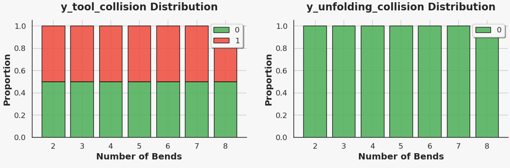
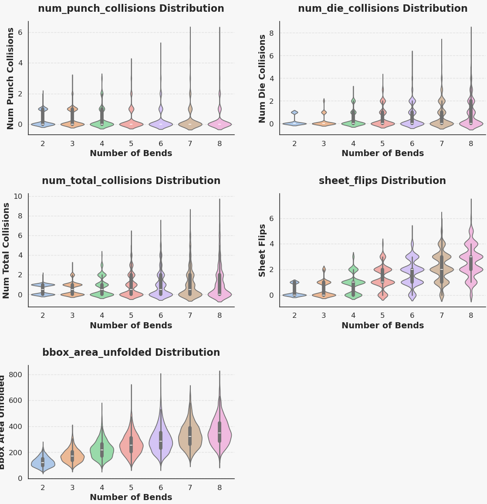

# Dataset Characteristics

## BenDFM subset
The BenDFM subset contains **14,000 parts** with **2 to 8 bends**.  
- **50%** of parts contain at least one tooling collision.  
- **No parts** contain unfolding overlaps.

---

### Collision Proportions

    

---

### Label Distributions

    

